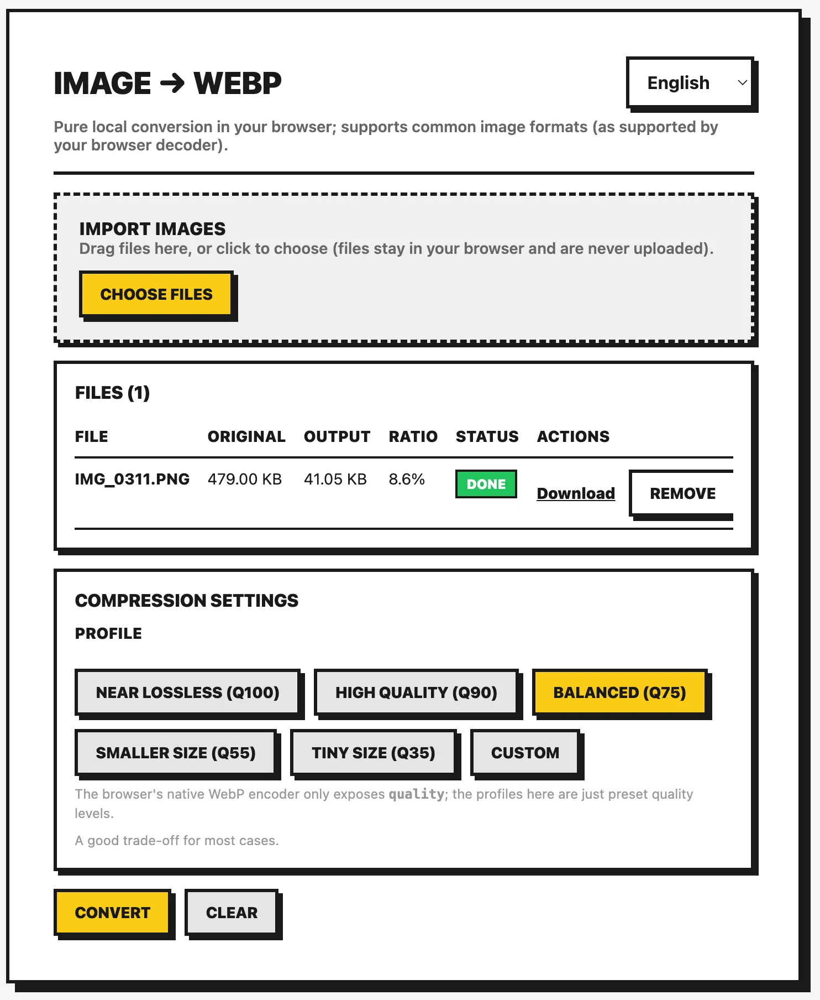

# Image to WebP

A fast, privacy-first image → WebP converter that runs entirely in your browser. No uploads to any server.

## Preview



## Online Demo

Live Preview: https://image-to-webp.tools.ioatlas.com/

Or run it locally (see below).

## Why This Tool?

Unlike typical “online converters”, this tool provides:

- **100% Local Processing** - Images never leave your device
- **Batch Conversion** - Drag & drop multiple files at once
- **Quality Profiles + Custom Quality** - Quick presets or fine-grained control
- **Clear Results Table** - Compare original vs output size and compression ratio, then download per file

## Features

### Import

- Drag & drop or click to select images
- Multi-file support (any image format your browser can decode)

### Quality Profiles

Choose a preset profile (internally mapped to a WebP quality value), or switch to Custom.

| Profile | Quality | Best For |
|--------|---------|----------|
| Lossless | 1.00 | Maximum fidelity |
| High | 0.90 | High-quality photos |
| Balanced | 0.75 | Everyday use |
| Small | 0.55 | Smaller files |
| Tiny | 0.35 | Smallest files (lower quality) |
| Custom | 0.00–1.00 | Full control (0–100 in UI) |

### Output & Download

- Preview conversion results in a table
- See output size and compression ratio
- Download each converted WebP, remove individual items, or clear all

### Other Features

- Multi-language UI (English, 繁體中文, 日本語, Deutsch, Français)
- Detects WebP encoding support (requires `canvas.toBlob('image/webp')`)

## Tech Stack

- **React 18** - UI framework
- **TypeScript** - Type safety
- **Vite** - Build tool

## Local Development

```bash
# Install dependencies
bun install

# Start dev server
bun run dev

# Build for production
bun run build

# Preview production build
bun run preview
```

## How It Works

1. Decodes images via `createImageBitmap` (with an `` fallback)
2. Draws the image onto a canvas
3. Encodes WebP using `canvas.toBlob('image/webp', quality)` and generates a downloadable file
